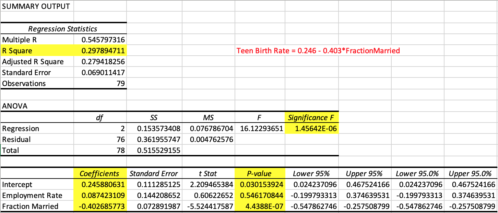

# Interactions Between Employment Rate, Fraction Married, and Teen Birth Rate of Census Tracts in Seattle, WA. 
## Background Information
The [Teen Pregnancy Prevention Program](https://opa.hhs.gov/grant-programs/teen-pregnancy-prevention-program-tpp/about-tpp), established under the Obama adminstration in 2010, funded longitudinal studies and projects in an effort to identify behavioral and sociocultural risk factors of teen pregnancy. In Seattle, WA, the change was drastic: Director of Public Health Patty Hayes attributed the program for the 55 percent drop in Seattle's teen pregnancy rates since 2008 [(source)](https://www.bloomberg.com/news/articles/2017-08-15/cities-fight-cuts-to-teen-pregnancy-prevention-program). Longitudinal research also revealed the [negatice outcomes](http://www.urbanchildinstitute.org/articles/research-to-policy/overviews/children-do-better-when-theyre-not-raised-by-children) of teen parenthood - compared to their counterparts, teenage mothers were more likely to drop out of school, remain unmarried, and live in poverty.

For cities like Seattle, WA, the implementation of the Teen Pregnancy Prevention Program continues to be successfully driving down teen birth rates. Using the negative outcomes of teen pregnancy identified by research studies, can we define a relationship between employment rate, fraction married and teen birth rates? 

## Business Question
Is there an interaction between negative outcomes of teen pregnancy, specifically employment rate and fraction married, and teen birth rates, and can we use such outcomes to predict the teen birth rate of a specific census tract in Seattle, WA?

## Data Question
Data were pulled from Opportunity Insights' [Opportunity Atlas](https://www.opportunityatlas.org/), an online database of anonymous data following 20 million Americans from childhood to mid-30s with the goal of identifying areas of the United States with best and worst social mobility. The [dataset](raw-data.xlsx) compiled employment rate, fraction married, and teen birth rate organized by census tract in Seattle, WA. 

## Data Answer

