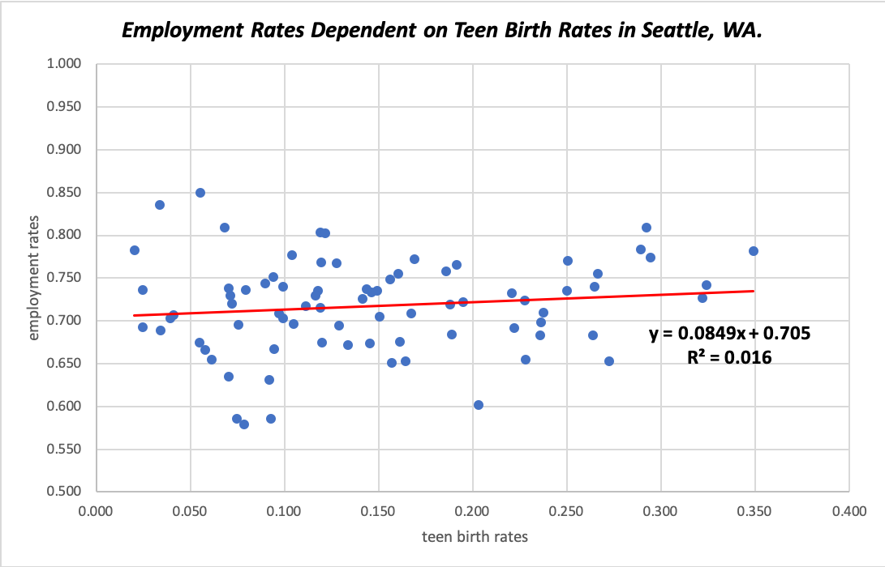
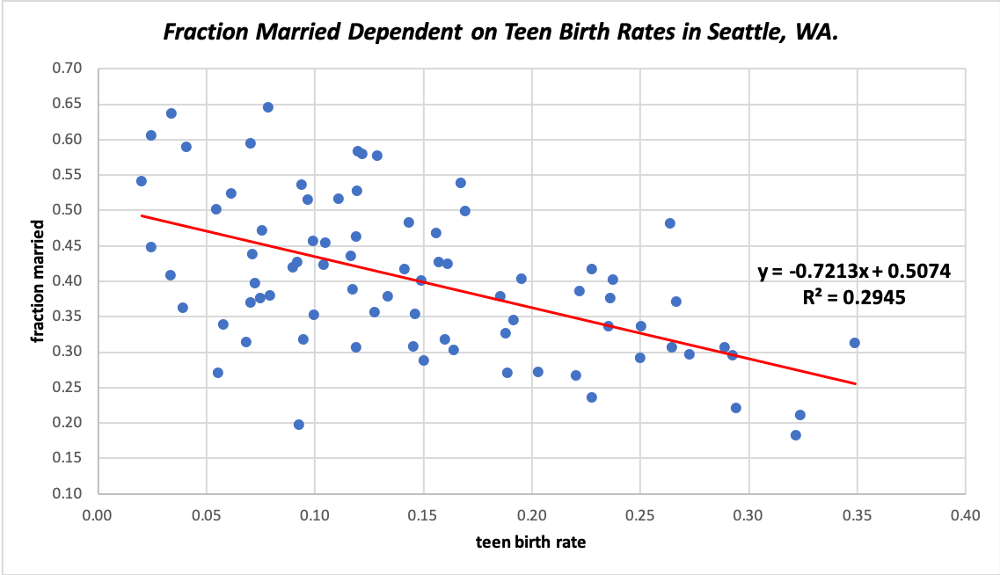

# Interactions Between Employment Rate, Fraction Married, and Teen Birth Rate of Neighborhoods in Seattle, WA. 
## Background Information
The [Teen Pregnancy Prevention Program](https://opa.hhs.gov/grant-programs/teen-pregnancy-prevention-program-tpp/about-tpp), established under the Obama adminstration in 2010, funded longitudinal studies and projects in an effort to identify behavioral and sociocultural risk factors of teen pregnancy. In Seattle, WA, the change was drastic: Director of Public Health Patty Hayes attributed the program for the 55 percent drop in Seattle's teen pregnancy rates since 2008 [(source)](https://www.bloomberg.com/news/articles/2017-08-15/cities-fight-cuts-to-teen-pregnancy-prevention-program). Longitudinal research also revealed the [negatice outcomes](http://www.urbanchildinstitute.org/articles/research-to-policy/overviews/children-do-better-when-theyre-not-raised-by-children) of teen parenthood - compared to their counterparts, teenage mothers were more likely to drop out of school, remain unmarried, and live in poverty.

For cities like Seattle, WA, the implementation of the Teen Pregnancy Prevention Program continues to be successfully driving down teen birth rates. Using the negative outcomes of teen pregnancy identified by research studies, can we define a relationship between employment rate, fraction married, and teen birth rates? 

## Business Question
Is there an interaction between negative outcomes of teen pregnancy, specifically employment rate and fraction married, and teen birth rates, and can we use such outcomes to predict the teen birth rate of a specific neighborhood in Seattle, WA?

## Data Question
Data were pulled from Opportunity Insights' [Opportunity Atlas](https://www.opportunityatlas.org/), an online database of anonymous data following 20 million Americans from childhood to mid-30s with the goal of identifying areas of the United States with best and worst social mobility. The [dataset](raw-data.xlsx) compiled employment rate, fraction married, and teen birth rate organized by neighborhood in Seattle, WA. 

## Data Answer

Using the multiple linear regression model, multiple data points indicate to us the relationship between employment rate, fraction married, and teen birth rates. The R-squared value tells us 29.8% of the data can be explained by the model; in other words, variation in one variable can be explained by the other variables to the accuracy of 29.8%. Thus, the prediction of teen birth rates using the two outcomes is relatively unreliable. 

Although the R-squared value is low, the p-value for each variable confirms its statistical significance. The statistical benchmark for p-value is 0.05: if the p-value is lower than 0.05, we can reject the null hypothesis and confirm a variable's significance. Both the intercept value and fraction married is below 0.05 and thus is statistically significant, while employment rate is not.

The statistical signficance of each variable in the multiple linear regression model is also corroborated by the simple linear regression models for (1) teen birth rate and employment rate and (2) teen birth rate and fraction married, both shown below:
  

When we compare both R-squared values, the linear regression model of teen birth rates and fraction married accurately captures a higher percentage of the data.

## Implications and Limitations of Data

From this data analysis, we observed a statistically significant relationship between teen birth rates and fraction married, but not between teen birth rates and employment rates in Seattle, WA. The interaction between teen birth rates and fraction married confirms previous research identifying the single marital status for teen mothers. However, one major limitation is the parameters of the dataset: both employment rate and fraction married accounted for all of the female population followed in Opportunity Atlas, not just women who had a teen birth. A much more accurate conclusion could be drawn from examining such outcomes within the population of teenage mothers. However, the statistical signficance of fraction married shows us that the lower the fraction married for a neighborhood, the higher the teenage birth rate.   

